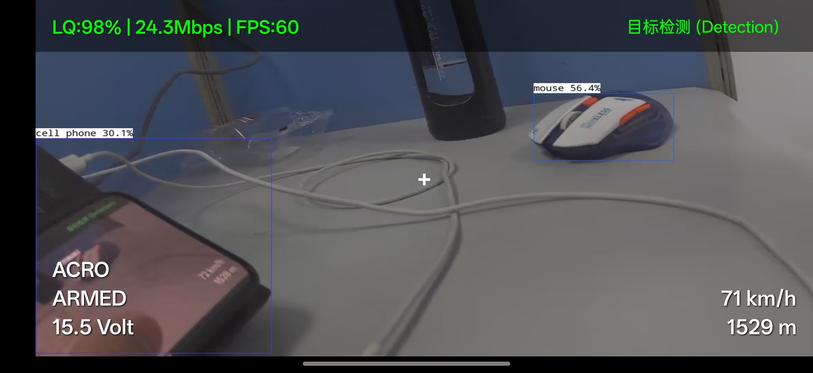
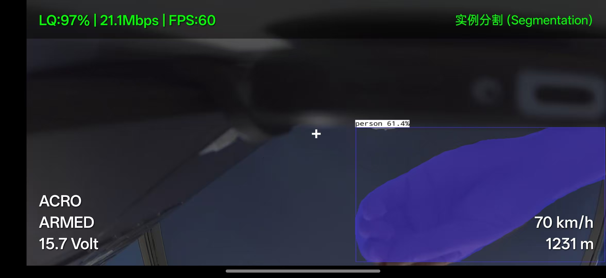
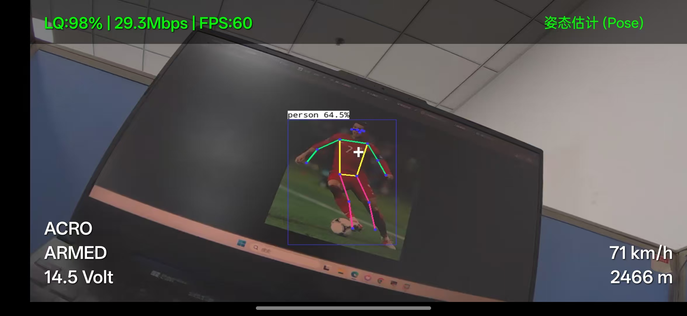
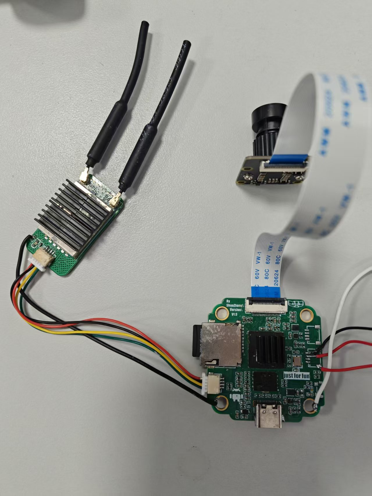

# zs-ipc

<p align="center">
  
  
  
  
</p>

<p align="center">
  <b><a href="#-简体中文">简体中文</a></b> | 
  <b><a href="#-english">English</a></b>
</p>

---

## 🇨🇳 简体中文

基于 Luckfox RV1106 SDK 与 Android NDK 的嵌入式无线 IPC（网络摄像头）开源项目。

本项目提供了一个“免复杂环境配置、开箱即用、软硬件闭环”的完整开源模板，非常适合定制化硬件开发者、物联网极客和多媒体图传/嵌入式 AI 开发者参考。

---

### 📷 运行效果与硬件展示

#### 1. 算法多任务切换效果 (Android 播放端)

我们通过手机端的多任务切换按钮，可以在以下三种高帧率 AI 推理模式间流畅切换：

<table>
  <tr>
    <td align="center" width="33%">
      <br/>
      <b>目标检测 (YOLOv8 Detection)</b>
    </td>
    <td align="center" width="33%">
      <br/>
      <b>语义分割 (YOLOv8 Segmentation)</b>
    </td>
    <td align="center" width="33%">
      <br/>
      <b>姿态估计 (YOLOv8 Pose)</b>
    </td>
  </tr>
</table>

#### 2. 定制无线图传主板实物展示

<p align="center">
  <br/>
  <b>基于 RV1106 芯片定制的 FPV 无线图传摄像头主板</b>
</p>

---

### 💾 免编译快速体验

如果您不想配置复杂的交叉编译环境，只想快速体验本项目，可以直接下载我们已经为您编译、配置完毕的开箱即用闭环套件：

👉 **[点击前往 GitHub Releases 页面下载最新固件与 APK](https://github.com/zstkr/zs-ipc/releases)**

*   **开发板端**：下载 `update.img` 后，直接使用瑞芯微官方烧录工具，通过 USB 将其烧录至您的定制主板（支持板载 SPI NAND 闪存启动）。
*   **手机播放端**：直接在您的安卓手机上安装 `zs-ipc.apk` 安装包即可。

---

### 📂 仓库目录结构

项目整体采用清爽、职责分明的多平台解耦目录结构：

*   `app/`：摄像头端 C/C++ 业务工程（基于 Luckfox MPI 媒体处理平台）。实现超低延迟的 H264 硬件视频编码与网络投递。
*   `android_app/`：手机播放端（Android Studio NDK 完整工程）。基于 GStreamer 实现视频流秒级低延迟解码，基于 NCNN 引擎驱动 YOLOv8 神经网络。
*   `os_patches/`：定制主板的系统配置文件、内核裁剪补丁、AP 自启脚本与外置网卡驱动。
*   `docs/`：存放项目文档相关的图片（如 `docs/images/` 目录）及媒体资源。
*   `hardware/`：存放硬件原理图工程，包含 📑 **[Zs-ipc_Sch 硬件原理图 PDF 版](hardware/zs-ipc_Sch.pdf)**。

---

### 📱 Android 播放端编译准备与二次开发

本播放端软件采用 Android Studio 进行开发（采用 Java + C/C++ 混合 NDK 架构）。为了保持代码仓库的轻量，本项目**未将大体积的第三方预编译依赖库**上传至 GitHub。如果您需要自行编译 Android 源码，请按照以下规范手动补全依赖：

#### 1. 本地依赖目录结构规范
依赖补全后，您的本地 `android_app/app/jni/` 目录结构应该如下所示：

```text
android_app/app/jni/
├── ncnn-20260113-android-vulkan/      <-- 手动下载并解压至此
├── opencv-mobile-4.13.0-android/      <-- 手动下载并解压至此
├── Android.mk
├── Application.mk
└── yolov8.cpp (等源码文件)
```

#### 2. 依赖下载与放置指引

*   **NCNN (Vulkan 支持)**
    *   **下载地址**：前往 [Tencent/ncnn Releases](https://github.com/Tencent/ncnn/releases) 下载 `ncnn-20260113-android-vulkan.zip`。
    *   **放置方法**：解压压缩包，将解压后的文件夹重命名为 `ncnn-20260113-android-vulkan` 并移动至 `android_app/app/jni/` 目录下。
*   **OpenCV-Mobile**
    *   **下载地址**：前往 [nihui/opencv-mobile Releases](https://github.com/nihui/opencv-mobile/releases) 下载 `opencv-mobile-4.13.0-android.zip`。
    *   **放置方法**：解压压缩包，将解压后的文件夹重命名为 `opencv-mobile-4.13.0-android` 并移动至 `android_app/app/jni/` 目录下。
*   **GStreamer Android SDK**
    *   **下载地址**：前往 [GStreamer 官网](https://gstreamer.freedesktop.org/download/) 下载对应 Android 架构（如 arm64-v8a）的 SDK。
    *   **配置方法**：在本地电脑中配置环境变量 `GSTREAMER_SDK_ROOT` 指向您的 SDK 路径（或在本地 `local.properties` 文件中指定）。

#### 3. 编译步骤
1. 完成上述依赖放置后，使用 **Android Studio** 打开 `android_app` 目录。
2. 等待 Gradle 同步完成后，选择 `Build` -> `Build Bundle(s) / APK(s)` -> `Build APK(s)` 即可编译生成手机端的 `.apk` 安装包。

#### 4. 播放端特色功能说明
在真机部署运行后，具有以下交互特性：
*   **AI 多任务一键切换**：支持在 **目标检测 (YOLOv8 Det)**、**语义分割 (YOLOv8 Seg)**、**姿态估计 (YOLOv8 Pose)** 之间一键动态切换。
*   **极速原图流旁路 (Bypass)**：支持切换为 “不使用模型 (纯视频流)” 模式。该模式下系统底层会完全释放 NCNN 模型并彻底闭合所有格式转换开销，零拷贝将原始 GStreamer 画面投递至屏幕，图传帧率和流畅度将达到极致满帧状态。
*   **双通道视频源切换**：支持一键在 “远端板载 IPC 视频流” 与 “手机本地摄像头” 之间进行无缝切换，极大方便了开发者在开发板未通电或外出时，直接用手机镜头评估 YOLOv8 模型的推理性能。

---

### 🛠️ 系统与内核编译补丁应用

如果您需要针对自己的硬件进行二次修改和编译，请按照以下规范，将 `os_patches/` 目录下的定制系统配置文件拷贝并覆盖到您本地官方标准的 Luckfox SDK 中：

#### 1. 拷贝定制文件
请在您的开发环境中执行以下覆盖拷贝操作（注意将 `<Luckfox_SDK_Path>` 替换为您本地 SDK 的实际路径）：

```bash
# A. 拷贝定制板级配置文件
cp os_patches/BoardConfig-SPI_NAND-Buildroot-RV1106-MyBoard-IPC.mk <Luckfox_SDK_Path>/project/cfg/BoardConfig_IPC/

# B. 拷贝裁剪后的轻量内核配置文件 (已关闭屏幕、触摸屏等，可节省大量运行内存)
cp os_patches/custom_kernel_defconfig <Luckfox_SDK_Path>/sysdrv/source/kernel/arch/arm/configs/luckfox_rv1106_linux_defconfig

# C. 拷贝精简后的 Buildroot 系统配置文件 (已将 OpenSSH 替换为轻量级 Dropbear，移除冗余 Python)
cp os_patches/custom_buildroot_defconfig <Luckfox_SDK_Path>/sysdrv/source/buildroot/buildroot-2023.02.6/configs/luckfox_pico_defconfig

# D. 拷贝定制主板设备树文件
cp os_patches/rv1106-zs-ipc.dts <Luckfox_SDK_Path>/sysdrv/source/kernel/arch/arm/boot/dts/rv1106g-luckfox-pico-pro-max.dts
```

#### 2. 激活并载入定制板子配置
进入您的 `<Luckfox_SDK_Path>` 根目录下，运行选择命令：

```bash
./build.sh lunch
```

1. 弹出第一级菜单时，输入 `11` 选择 `custom`（自定义）。
2. 在随后弹出的长列表中，系统会自动检索并显示我们的定制板级配置 `BoardConfig-SPI_NAND-Buildroot-RV1106-MyBoard-IPC.mk`。
3. 输入它前面对应的 **序号**，回车确认，完成激活。

#### 3. 一键编译系统与打包
在 SDK 根目录下依次执行以下命令，完成全新编译和打包：

```bash
./build.sh clean
./build.sh all
./build.sh firmware
```

打包成功后，可在 `<Luckfox_SDK_Path>/output/image/` 目录下找到专属打包的轻量级固件（`update.img`）。

---

### ⚙️ 网卡驱动与系统自启配置 (start.sh)

系统烧录完毕并启动后，需要通过 `start.sh` 脚本来初始化无线网络。

#### 1. 脚本核心功能
本项目提供的 `start.sh` 脚本，可一键完成以下闭环逻辑：
*   **加载驱动**：自动加载 `8812au.ko` 无线网卡内核驱动。
*   **配置热点**：自动启动 `hostapd` 并开启局域网 Wi-Fi AP 热点。
*   **防休眠锁定**：物理锁定 USB 接口，防止其因系统空闲而自动进入低功耗休眠，保障图传链路的稳定性。

#### 2. 运行方式说明

##### 方案 A：手动运行测试
将 `start.sh` 拷贝到板子中，赋予权限并执行：

```bash
chmod +x start.sh
./start.sh
```

##### 方案 B：配置开机自动运行（Buildroot 规范）
如果您希望开发板上电后自动开启热点和图传，请按照以下规范将其配置为开机自启：

1. 将 `start.sh` 复制到开发板系统的 `/etc/init.d/` 目录下。
2. 将其重命名为 `S99zs_ipc`（系统会在开机启动的末尾自动调用 `S99` 开头的脚本）：

```bash
mv /path/to/start.sh /etc/init.d/S99zs_ipc
chmod +x /etc/init.d/S99zs_ipc
```

---

### 📄 开源协议

本项目软件部分采用 **MIT** 开源协议，允许他人自由修改、分发及商用。

---
---

## 🇺🇸 English

An open-source, full-stack, highly decoupled wireless IPC (IP Camera) project based on the Luckfox RV1106 SDK and Android NDK.

This project provides a "zero-configuration, out-of-the-box, closed-loop" complete open-source template. It is highly suitable for custom hardware developers, IoT geeks, and multimedia transmission/embedded AI developers.

---

### 📷 Showcase & Hardware

#### 1. Multi-Task AI Switch (Android Client)

Using the multi-task toggle buttons on the Android side, you can seamlessly switch between the following three high-frame-rate AI inference modes:

<table>
  <tr>
    <td align="center" width="33%">
      <br/>
      <b>YOLOv8 Detection</b>
    </td>
    <td align="center" width="33%">
      <br/>
      <b>YOLOv8 Segmentation</b>
    </td>
    <td align="center" width="33%">
      <br/>
      <b>YOLOv8 Pose Estimation</b>
    </td>
  </tr>
</table>

#### 2. Custom Wireless Video Transmitter PCB

<p align="center">
  <br/>
  <b>Custom FPV wireless video transmitter camera board based on the RV1106 chip</b>
</p>

---

### 💾 Pre-compiled Firmware & APK

If you prefer to skip the complex cross-compilation environment and jump straight into testing, you can download our pre-compiled, out-of-the-box closed-loop suite:

👉 **[Click here to download the latest Firmware & APK from GitHub Releases](https://github.com/zstkr/zs-ipc/releases)**

*   **Development Board**: Download `update.img` and flash it to your custom board (supporting SPI NAND startup) via USB using the Rockchip official flashing tool.
*   **Android Client**: Install the `zs-ipc.apk` directly on your Android smartphone.

---

### 📂 Directory Structure

The repository is organized with a clean, platform-decoupled architecture:

*   `app/`：Camera-side C/C++ application (based on Luckfox MPI platform). Implements ultra-low latency H264 hardware encoding and network streaming.
*   `android_app/`：Android client (complete Android Studio NDK project). Implements sub-second low-latency decoding via GStreamer and runs YOLOv8 model inference via NCNN.
*   `os_patches/`：Custom board system config files, kernel minimal defconfigs, AP auto-start scripts, and external wireless card drivers.
*   `docs/`：Stores project documentation images and media resources.
*   `hardware/`：Stores hardware schematics project, including 📑 **[Zs-ipc_Sch Schematic PDF Version](hardware/zs-ipc_Sch.pdf)**.

---

### 📱 Android Client Build Setup & Customization

The Android client is built using Android Studio (Java + C/C++ NDK). To keep the repository lightweight, **large precompiled third-party libraries are not uploaded to GitHub**. If you wish to compile the Android source code by yourself, please manually supplement the dependencies as specified below:

#### 1. Local Directory Structure for Dependencies
Once completed, your local `android_app/app/jni/` folder structure should look like this:

```text
android_app/app/jni/
├── ncnn-20260113-android-vulkan/      <-- Download and unzip here
├── opencv-mobile-4.13.0-android/      <-- Download and unzip here
├── Android.mk
├── Application.mk
└── yolov8.cpp (and other source files)
```

#### 2. Download Instructions

*   **NCNN (Vulkan Enabled)**
    *   **Download**: Go to [Tencent/ncnn Releases](https://github.com/Tencent/ncnn/releases) and download `ncnn-20260113-android-vulkan.zip`.
    *   **Installation**: Extract the archive, rename the folder to `ncnn-20260113-android-vulkan`, and move it to `android_app/app/jni/`.
*   **OpenCV-Mobile**
    *   **Download**: Go to [nihui/opencv-mobile Releases](https://github.com/nihui/opencv-mobile/releases) and download `opencv-mobile-4.13.0-android.zip`.
    *   **Installation**: Extract the archive, rename the folder to `opencv-mobile-4.13.0-android`, and move it to `android_app/app/jni/`.
*   **GStreamer Android SDK**
    *   **Download**: Download the Android SDK for your target architecture (e.g., arm64-v8a) from the [GStreamer Download Page](https://gstreamer.freedesktop.org/download/).
    *   **Configuration**: Configure the environment variable `GSTREAMER_SDK_ROOT` on your system to point to the SDK directory (or define it in your local `local.properties` file).

#### 3. How to Build
1. After setting up the dependencies, open the `android_app` directory inside **Android Studio**.
2. Wait for the Gradle sync to finish.
3. Select `Build` -> `Build Bundle(s) / APK(s)` -> `Build APK(s)` to compile the installation `.apk` package.

#### 4. Android Client Key Features
When running on an actual device, the app offers the following interactive features:
*   **One-Key AI Task Switching**: Seamlessly toggle between **Object Detection (YOLOv8 Det)**, **Instance Segmentation (YOLOv8 Seg)**, and **Pose Estimation (YOLOv8 Pose)** in real-time.
*   **Zero-Copy Bypass (Pure Stream)**: Supports switching to "No Model (Pure Video Stream)" mode. In this mode, the underlying system releases the NCNN model and closes format conversion overhead, rendering the raw GStreamer video directly to the screen at full frames.
*   **Dual-Channel Video Source**: Easily switch between the "Remote IPC Video Stream" and "Mobile Local Camera," allowing developers to test YOLOv8 model inference performance even when the hardware board is powered off.

---

### 🛠️ System & Kernel Compilation Patches

If you need to modify and compile the system for your own custom hardware, please follow the steps below to copy and overwrite the configuration files in your local official Luckfox SDK:

#### 1. Copy Custom Files
Run the following copy commands in your development environment (replace `<Luckfox_SDK_Path>` with your actual local SDK path):

```bash
# A. Copy custom board configuration file
cp os_patches/BoardConfig-SPI_NAND-Buildroot-RV1106-MyBoard-IPC.mk <Luckfox_SDK_Path>/project/cfg/BoardConfig_IPC/

# B. Copy the pruned kernel config (disabled screen, touchscreen, etc., to save RAM)
cp os_patches/custom_kernel_defconfig <Luckfox_SDK_Path>/sysdrv/source/kernel/arch/arm/configs/luckfox_rv1106_linux_defconfig

# C. Copy pruned Buildroot system config (replaced OpenSSH with Dropbear, removed redundant Python)
cp os_patches/custom_buildroot_defconfig <Luckfox_SDK_Path>/sysdrv/source/buildroot/buildroot-2023.02.6/configs/luckfox_pico_defconfig

# D. Copy custom board device tree file
cp os_patches/rv1106-zs-ipc.dts <Luckfox_SDK_Path>/sysdrv/source/kernel/arch/arm/boot/dts/rv1106g-luckfox-pico-pro-max.dts
```

#### 2. Activate & Load Custom Board Config
Navigate to your `<Luckfox_SDK_Path>` root folder and run:

```bash
./build.sh lunch
```

1. When the first-level menu pops up, input `11` to select `custom`.
2. In the long list that follows, the system will automatically scan and display our custom configuration: `BoardConfig-SPI_NAND-Buildroot-RV1106-MyBoard-IPC.mk`.
3. Input the **corresponding index number** and press Enter to activate.

#### 3. Compile and Package
Execute the following commands sequentially at the SDK root folder to compile and package:

```bash
./build.sh clean
./build.sh all
./build.sh firmware
```

Once succeeded, you can find the custom packaged lightweight firmware (`update.img`) in the `<Luckfox_SDK_Path>/output/image/` directory.

---

### ⚙️ Driver & Auto-Start Configuration (start.sh)

After the system is successfully flashed and booted, the wireless network needs to be initialized via the `start.sh` script.

#### 1. Key Script Features
The `start.sh` script provided in this project automatically completes the following closed-loop operations:
*   **Load Driver**: Automatically loads the `8812au.ko` wireless network card kernel driver.
*   **AP Config**: Launches `hostapd` to start a local Wi-Fi AP hotspot.
*   **USB Power Lock**: Physically locks the USB port state, preventing it from entering low-power sleep mode when idle, ensuring transmission stability.

#### 2. Running Guide

##### Option Guide

###### Option A: Manual Testing
Copy `start.sh` to the board, grant execution permission, and run:

```bash
chmod +x start.sh
./start.sh
```

###### Option B: Configure Auto-Start (Buildroot Standard)
To enable the board to start the hotspot and video transmission automatically on power-up, configure it as follows:

1. Copy `start.sh` to the `/etc/init.d/` directory on the board.
2. Rename it to `S99zs_ipc` (the system automatically invokes scripts starting with `S99` at the end of the boot sequence):

```bash
mv /path/to/start.sh /etc/init.d/S99zs_ipc
chmod +x /etc/init.d/S99zs_ipc
```

---

### 📄 License

The software part of this project is licensed under the **MIT License** - see the LICENSE file for details.